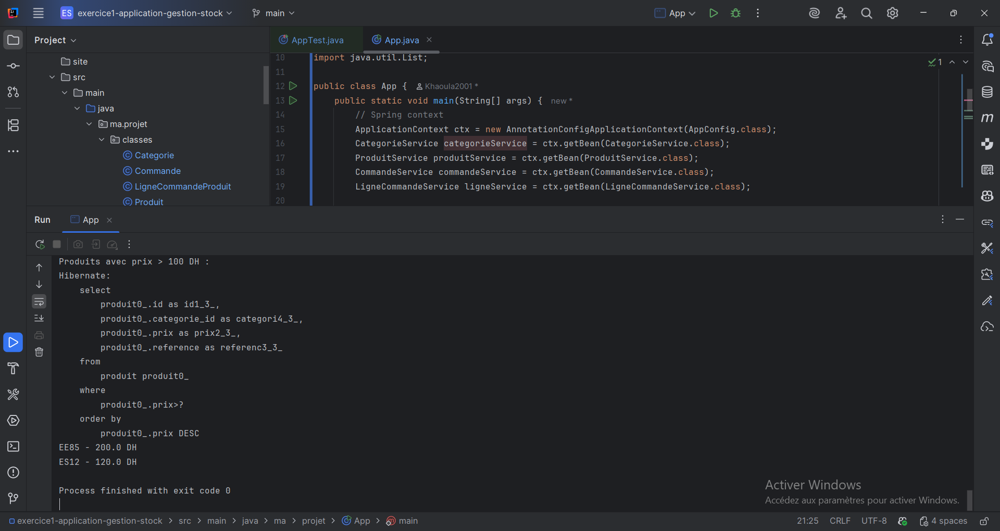
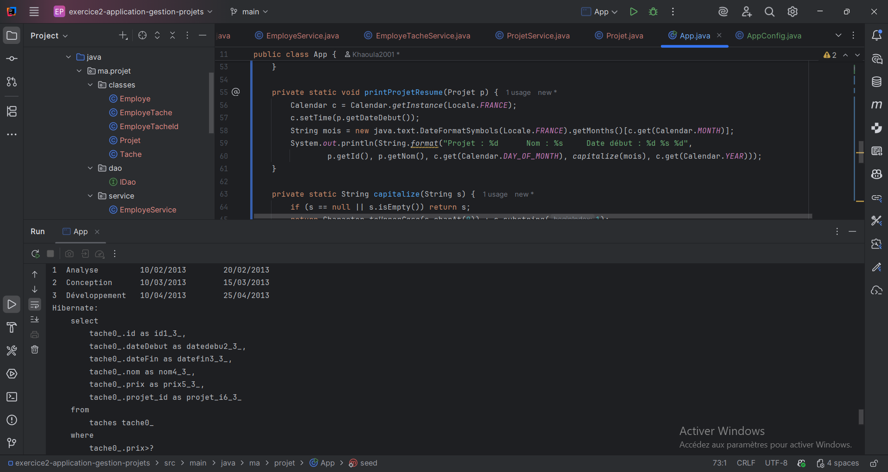
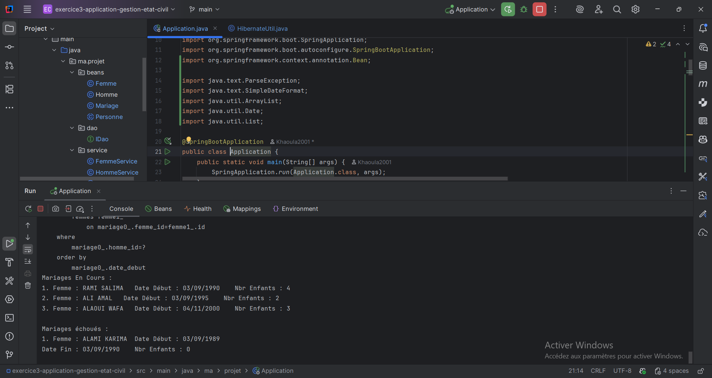

# Évaluation — Architecture Microservices: Conception, Déploiement et Orchestration

Ce dépôt regroupe trois mini‑applications Java/Hibernate réalisées pour l’évaluation. Chaque exercice suit une architecture en couches (Persistance, Service) avec des tests/démos et des captures d’exécution.

Sommaire
- Exercice 1 — Application de gestion de stock
- Exercice 2 — Application de gestion de projets
- Exercice 3 — Application de gestion de l’état civil

---

## Exercice 1 — Application de gestion de stock
Contexte: gérer le stock d’un magasin de produits informatiques.

Réalisation (résumé):
- Couche Persistance: entités `Produit`, `Categorie`, `Commande`, `LigneCommandeProduit`; config `application.properties`; util `HibernateUtil`.
- Couche Service: `IDao` (générique), services `ProduitService`, `CategorieService`, `CommandeService`, `LigneCommandeService`.
- Fonctions clés: 
  - Produits par catégorie.
  - Produits commandés entre deux dates.
  - Produits d’une commande donnée (affichage détaillé).
  - Produits avec prix > 100 DH (requête nommée).
- Tests: classe `ProduitServiceTest` avec jeux de données et vérifications des requêtes.

Captures d’écran (exécution/tests et base de données):

---

## Exercice 2 — Application de gestion de projets
Contexte: suivi des temps et calcul des coûts des projets.

Réalisation (résumé):
- Couche Persistance: entités `Projet`, `Tache`, `Employe`, `EmployeTache`; config `application.properties`; util `HibernateUtil`.
- Couche Service: `IDao`, services `ProjetService`, `TacheService`, `EmployeService`, `EmployeTacheService`.
- Fonctions clés:
  - EmployeService: tâches réalisées par un employé, projets gérés par un employé.
  - ProjetService: tâches planifiées d’un projet, tâches réalisées avec dates réelles.
  - TacheService: tâches avec prix > 1000 DH (nommée), tâches réalisées entre deux dates.

Captures d’écran (exécution et base de données):

---

## Exercice 3 — Application de gestion de l’état civil
Contexte: gestion des citoyens et relations matrimoniales d’une province.

Réalisation (résumé):
- Couche Persistance: entités `Homme`, `Femme`, `Mariage` (JPA Annotations) dans `ma.projet.beans` + config `application.properties` + `HibernateUtil`; DB MySQL générée.
- Couche Service: `IDao`, services `HommeService`, `FemmeService`, `MariageService`.
- Méthodes clés demandées:
  - `HommeService`: épouses d’un homme entre deux dates.
  - `FemmeService`: requête native nommée — nombre d’enfants d’une femme entre deux dates; requête nommée — femmes mariées au moins deux fois.
  - API Criteria: nombre d’hommes mariés à quatre femmes entre deux dates.
  - Détail des mariages d’un homme (épouse, dates, nombre d’enfants).
- Programme de test/démo: création de 10 femmes et 5 hommes, affichages demandés.

Captures d’écran (exécution et base de données):

---

## Lancement rapide
- Chaque exercice est un module Maven indépendant.
- Prérequis: Java 17+, Maven, MySQL (voir les fichiers `application.properties` de chaque module).
- Pour exécuter les démos/tests :
  - `exercice1`: lancer les tests `ProduitServiceTest` ou la classe `ma.projet.App`.
  - `exercice2`: exécuter `ma.projet.App` (seed + affichages), ou tests fournis.
  - `exercice3`: exécuter `ma.projet.Application` (affichages demandés).

Notes:
- Les captures d’écran d’exécution et de la base de données sont disponibles dans le dossier `screens/` classées par exercice.
- Les méthodes demandées (requêtes nommées, natives, Criteria, filtres par dates/catégories, etc.) sont implémentées dans la couche Service correspondante.
