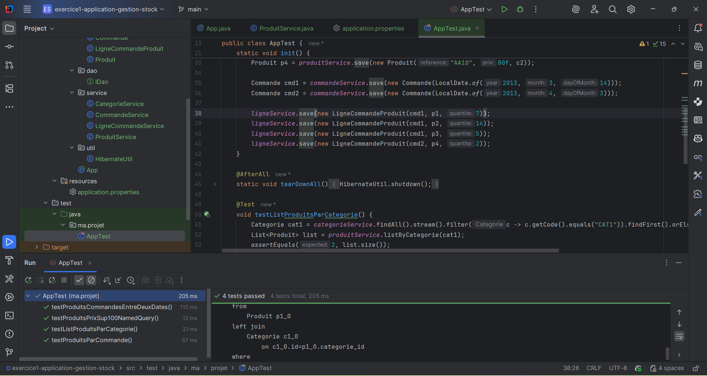
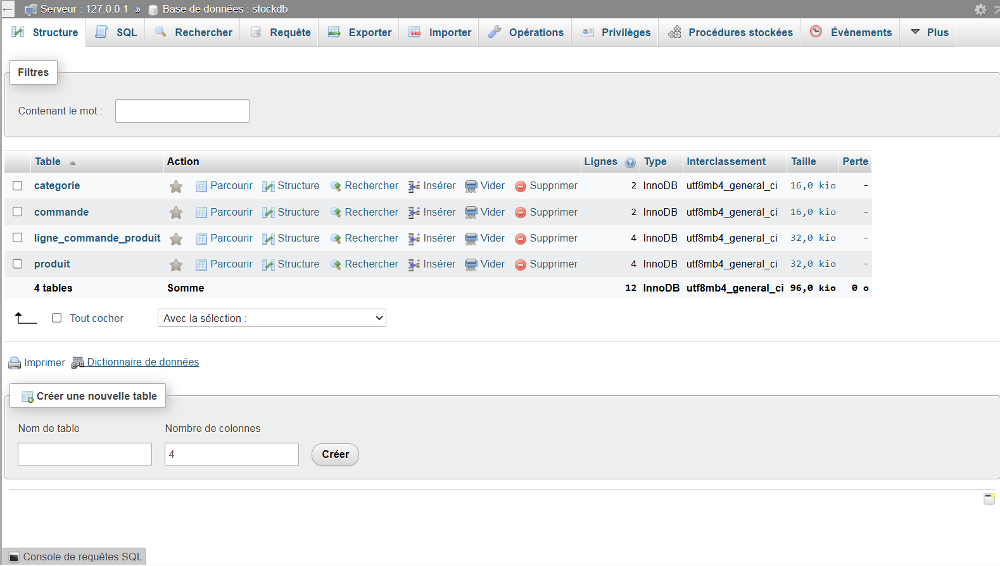
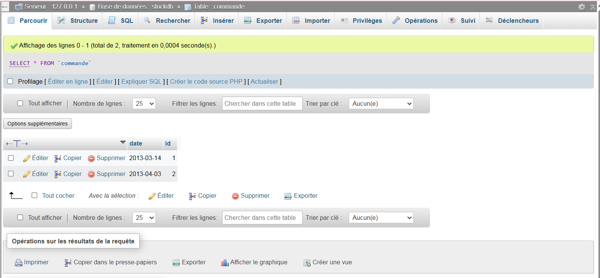
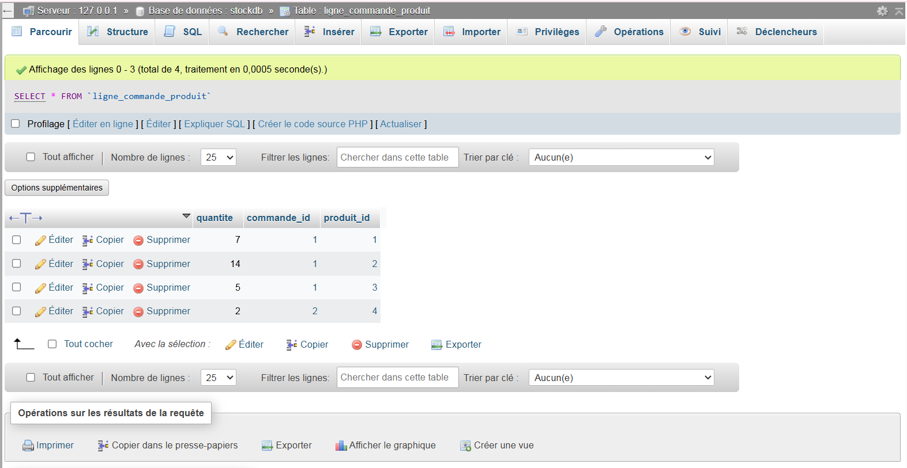

# Exercice 1 — Application gestion de stock

Ce dépôt contient une petite application Java/Hibernate permettant de gérer des catégories, produits, commandes et lignes de commande. Des tests unitaires JUnit initialisent une base de données en mémoire (ou configurée via `application.properties`) et valident plusieurs cas d’usage.

---

## 1) Résultats après exécution

1. Exécution des tests dans l’IDE (tous passent)
   - Les 4 tests JUnit passent avec succès :
     - `testListProduitsParCategorie`
     - `testProduitsCommandesEntreDeuxDates`
     - `testProduitsParCommande`
     - `testProduitsPrixSup100NamedQuery`
   - L’initialisation insère 2 catégories, 4 produits, 2 commandes et 4 lignes de commande.

   

2. État de la base de données
   - Les tables `categorie`, `commande`, `produit`, `ligne_commande_produit` sont bien créées et peuplées.

   

3. Table `produit`
   - Quatre produits insérés avec leurs références, prix et liens vers `categorie`.

   

4. Table `commande`
   - Deux commandes datées: 2013‑03‑14 et 2013‑04‑03.

   

5. Table `categorie`
   - Deux catégories: `CAT1` (Ordinateurs) et `CAT2` (Écrans).

   

6. Table `ligne_commande_produit`
   - Quatre lignes de commande illustrant les quantités par produit et par commande.

   

---

## 2) Lancer le projet

- Prérequis: Java 17+, Maven 3.8+.
- Depuis la racine de ce module:
  - Compiler et lancer les tests: `mvn -q -DskipTests=false test`
  - (Option) Exécuter la classe `App` depuis l’IDE si nécessaire.

La configuration de la base (URL, utilisateur, mot de passe, dialecte) se trouve dans `src/main/resources/application.properties`.

---

## 3) Structure fonctionnelle testée

- Lister les produits d’une catégorie donnée.
- Lister les produits commandés entre deux dates.
- Lister les produits d’une commande avec prix et quantités (jointure).
- Requête nommée pour les produits dont le prix est > 100.

---

## 4) Références de code utiles

- Services: `CategorieService`, `ProduitService`, `CommandeService`, `LigneCommandeService`.
- Entités: `Categorie`, `Produit`, `Commande`, `LigneCommandeProduit`.
- Tests: `src/test/java/ma/projet/AppTest.java`.

